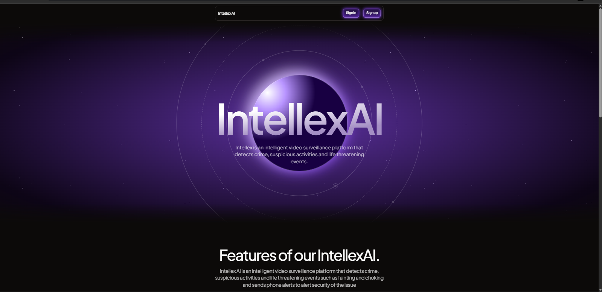

# IntellexAI - Intelligent Video Surveillance

## 🚀 Inspiration

Traditional surveillance systems are passive and often fail to provide timely insights, leaving security teams overwhelmed with countless video feeds. IntellexAI was built to bridge this gap by transforming video surveillance into an intelligent, real-time security solution. Our goal is to enhance public and private safety by enabling automated threat detection, reducing response times, and ensuring no critical event goes unnoticed. From local businesses to large-scale facilities, IntellexAI ensures that security is proactive rather than reactive.

## 🛠 What It Does

IntellexAI is an AI-powered surveillance platform that:
- Detects crime, suspicious activities, and emergencies (e.g., fainting, choking, fighting).
- Sends real-time alerts to security teams via email and phone notifications.
- Generates time-stamped incident reports with video evidence.

### 🔑 Key Features
1. **Real-time Video Analysis** using Google's Gemini Visual Language Model.
2. **MP4 Upload Feature** for crime and event analysis on recorded footage.
3. **Investigation Mode** allows users to ask AI to analyze videos for specific events (e.g., detecting people smoking with timestamps and frames).
4. **Event Library** stores analyzed videos with security insights and timelines.
5. **AI-Powered Assistance** via OpenAI for real-time context-aware guidance.
6. **Statistics Page** with AI summaries, chart-based insights, and CSV export.
7. **Live Robo Camera Integration** via IP-based Arduino-powered tracking.

## 🏗️ Tech Stack
- **Frontend:** Next.js 13+, TypeScript, ShadCN UI, Aceternity UI, Tailwind CSS, Framer Motion
- **Backend:** Supabase (Authentication & Database)
- **AI Processing:** Google's Gemini API, TensorFlow.js
- **Real-time Communication:** Canvas API
- **Notifications:** Resend API (Email & Phone Alerts)
- **Hardware Integration:** Arduino, GPS Module, Bluetooth module, Chasis, ultrasonic sensor, servo motor, Esp32 Cam

## 🛠 Challenges We Faced
- Making the Robot(RC Car).
- Robot Integration with the Software.
- Balancing real-time video processing with performance constraints.
- Reducing false positives in AI detection.
- Handling multiple video streams efficiently.

## 🎉 Accomplishments
- Developed a fully functional AI surveillance system in 24 hours.
- Achieved real-time video analysis with minimal latency.
- Designed an intuitive and scalable architecture that can handle multiple cameras.
- Developed a system that's accessible through any IP Cameras.

## 🏁 Conclusion
IntellexAI aims to revolutionize security surveillance by making it smarter, faster, and more effective. Whether for local businesses, hospitals, or large shopping malls, IntellexAI ensures that security personnel never miss a critical moment again.

---
### 📌 Made with ❤️ by Team IntellexAI
